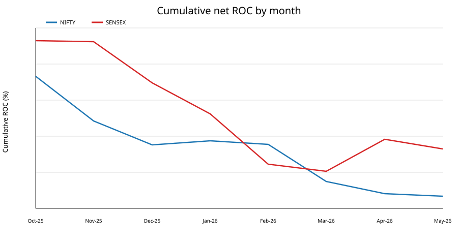
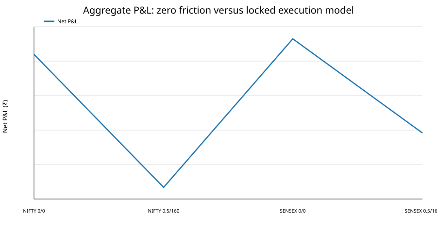
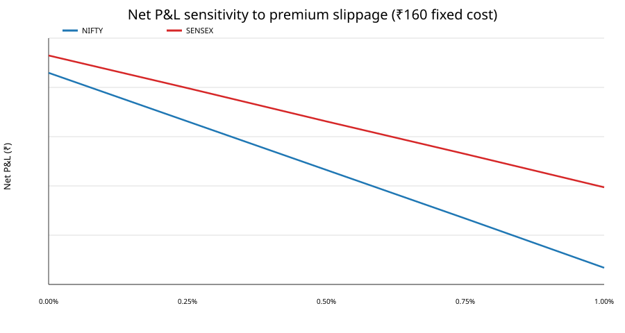
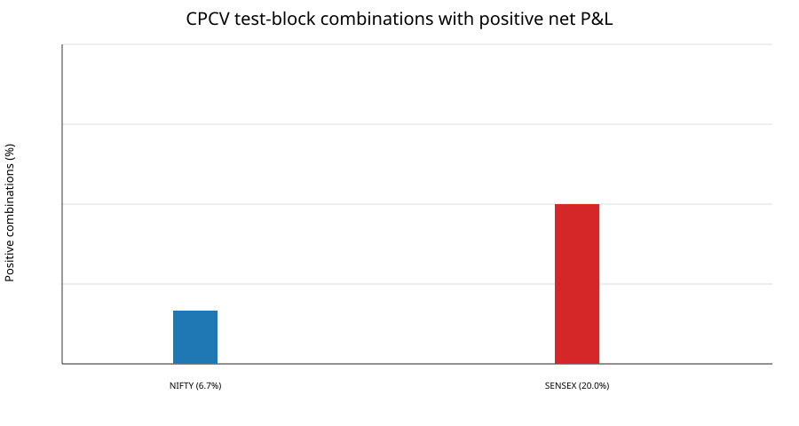

# MinDip Research Manuscript

## Title

**Historical and Robustness Evaluation of a Locked Four-Leg Multi-Expiry Reverse-Calendar Strategy on NIFTY 50 and BSE SENSEX**

## Abstract

This study evaluates a prespecified four-leg, multi-expiry reverse-calendar options basket on NIFTY 50 and BSE SENSEX. The specification was locked before empirical evaluation: entry uses the 09:30 spot observation; the basket buys the monthly ATM put, sells the weekly ATM+2-strike put, buys the weekly ATM call, and sells the monthly ATM-2-strike call; the position is exited at the weekly expiry using the last available observation at or before 15:15. The historical sample covers 2025-10-01 through 2026-05-27, with exchange-holiday logic explicitly separated from data availability.

The corrected dataset yielded 34 target cycles for each index, with 33 fully executable NIFTY baskets and 28 fully executable SENSEX baskets. Under the locked execution model of 0.5% adverse premium slippage and ₹160 fixed cost per completed cycle, net P&L was approximately ₹-44,823 for NIFTY and ₹-33,426 for SENSEX, corresponding to -29.88% and -22.28% of the ₹1,50,000 capital denominator. Both samples were also negative under a zero-friction counterfactual. CPCV chronology diagnostics remained predominantly negative, while the untouched final chronology block was negative for both indices. A multiple-trial Deflated Sharpe Ratio and Probability of Backtest Overfitting were not estimable because the research intentionally retained a single prespecified strategy rather than creating a post-hoc candidate family.

The evidence therefore does not support treating the locked specification as a validated positive-return strategy over this sample. The most important next research step is not parameter optimization of the same sample, but independent execution-quality validation, a larger out-of-sample dataset, direct bid/ask history, and a preregistered candidate-family design before any future DSR/PBO selection analysis.

---

## 1. Research question

Does the specified four-leg, multi-expiry reverse-calendar basket produce economically meaningful and robust returns on NIFTY 50 and BSE SENSEX after realistic implementation frictions, with the exact user-defined expiry, holiday, strike, timing, slippage, and fixed-cost rules?

## 2. Aims and objectives

### Aim

To quantify the historical, statistical, execution-cost, and chronology-robustness characteristics of the locked MinDip reverse-calendar specification.

### Objectives

1. Implement the strategy deterministically for NIFTY 50 and BSE SENSEX.
2. Construct point-in-time, strategy-specific datasets without look-ahead.
3. Measure trade-level and aggregate net performance after the locked cost/slippage assumptions.
4. Stress implementation friction, chronology, and historical regime dependence without changing the primary result.
5. Assess whether cross-validation diagnostics support stability.
6. Preserve all data, code, errors, assumptions, and outputs in the repository for reproducibility.

---

## 3. Strategy specification

| Component | Locked rule |
|---|---|
| Entry time | First available observation at/after 09:30 IST |
| NIFTY expiry cadence | Tuesday weekly; last Tuesday monthly |
| SENSEX expiry cadence | Thursday weekly; last Thursday monthly |
| Holiday rule | Roll backward to previous valid trading day |
| Strike interval | 50 points NIFTY; 100 points SENSEX |
| ATM rule | Half-up rounding of 09:30 spot |
| Leg 1 | Buy monthly ATM PE |
| Leg 2 | Sell weekly ATM + 2 strikes PE |
| Leg 3 | Buy weekly ATM CE |
| Leg 4 | Sell monthly ATM - 2 strikes CE |
| Exit | Last available observation at/before 15:15 on weekly expiry |
| Premium slippage | 0.5% adverse on every leg, entry and exit |
| Fixed cost proxy | ₹40 per leg; ₹160 per completed four-leg cycle |
| Capital denominator | ₹1,50,000 |
| Primary sample | 2025-10-01 to 2026-05-27 |

The primary strategy was not tuned after seeing the historical outcomes.

---

## 4. Data sources and provenance

The primary option source is the public Hugging Face dataset **rissin/nse-options-intraday**, pinned in the repository to revision 8f7739cab3f38abdcbc6332a6d0a83e1341326e3. The repository queries yearly NIFTY and SENSEX Parquet partitions remotely and caches only the reduced strategy-specific extract.

Spot data are sourced from **thetrademarkk/india-index-options-1m**, pinned to the repository revision recorded in the Phase 2 script.

The repository maintains:

- source URLs and revisions in docs/DATA_SOURCE_REGISTRY.md;
- reduced raw/selected-leg cache in data/cache/phase2/;
- checksums in data/cache/phase2/MANIFEST.json;
- explicit holiday calendar in data/calendar/exchange_holidays.csv;
- correction history in ERROR_LOG.md.

The explicit holiday calendar was introduced after a material audit finding: missing observations in a spot dataset must not be interpreted as exchange holidays. That mistake changed expiry dates and was superseded by the corrected run.

### Dataset coverage

| Index | Target cycles | Spot-available cycles | Complete four-leg cycles | Window |
|---|---:|---:|---:|---|
| NIFTY | 34 | 34 | 33 | 2025-10-01 to 2026-05-27 |
| SENSEX | 34 | 33 | 28 | 2025-10-01 to 2026-05-27 |

One SENSEX cycle lacked a usable 09:30 spot observation and was therefore excluded from executable-cycle calculations. Additional option-level gaps caused incomplete baskets to be skipped rather than imputed.

---

## 5. Execution-cost methodology

The primary backtest uses an adverse premium slippage factor of 0.5% on every leg at entry and exit, plus ₹40 fixed cost per leg.

This is intentionally a deterministic historical execution proxy, not a claim that the exact historical broker bill equals ₹160 per cycle.

For current external validation, Paytm Money's F&O FAQ states that brokerage is ₹10 per unique executed F&O order; its pricing materials also state that statutory, regulatory, and exchange charges are levied at actuals and that the brokerage calculator does not include some additional fees. Therefore, a current brokerage-only illustration of eight unique orders (four entries plus four exits) would be ₹80 before statutory/exchange/other charges, but that is not a substitute for reconstructing the historical all-in broker ledger. The research therefore retains ₹160 as the locked primary proxy and explicitly stress-tests lower and higher cost assumptions.

---

## 6. Statistical methodology

Phase 3 computed:

- total net P&L and return on the ₹1,50,000 capital denominator;
- win rate;
- maximum drawdown and drawdown percentage;
- mean positive trade and mean negative trade;
- expectancy;
- profit factor;
- trade-level Sharpe diagnostic;
- skewness;
- bootstrap 95% intervals for mean trade P&L and win rate.

Phase 4 added:

- slippage grid: 0%, 0.25%, 0.50%, 0.75%, 1.00%;
- fixed cost grid: ₹0, ₹80, ₹160, ₹240, ₹320 per completed cycle;
- zero-friction counterfactual;
- chronology block diagnostics;
- prior-4-cycle spot-volatility context.

Phase 5 added:

- six chronology blocks per index;
- all 15 two-block test combinations;
- one-block neighbor purging from the training subset;
- untouched final chronology-block holdout;
- sign-flip permutation test of zero mean trade P&L;
- DSR identifiability assessment;
- PBO identifiability assessment.

Because the strategy is fixed and no parameters are fit on the training set, CPCV is interpreted as a chronology-stability distribution rather than a model-selection exercise.

---

## 7. Results

### 7.1 Primary historical performance

| Metric | NIFTY | SENSEX |
|---|---:|---:|
| Complete trades | 33 | 28 |
| Net P&L | ₹-44,822.58 | ₹-33,425.66 |
| ROC on ₹1,50,000 | -29.88% | -22.28% |
| Win rate | 36.36% | 25.00% |
| Max drawdown | ₹-44,857.28 | ₹-41,917.04 |
| Max drawdown (%) | -30.65% | -27.38% |
| Average winning trade | ₹1,846.11 | ₹2,093.82 |
| Average losing trade | ₹-3,189.33 | ₹-2,289.64 |
| Expectancy / trade | ₹-1,358.26 | ₹-1,193.77 |
| Profit factor | 0.331 | 0.305 |
| Trade Sharpe diagnostic | -0.425 | -0.400 |
| Bootstrap 95% CI, mean P&L | [-₹2,421.79, -₹292.76] | [-₹2,266.61, -₹97.38] |

### 7.2 Cumulative path

The cumulative path stays below the initial capital baseline after the early sample decline. NIFTY shows its deepest drawdown around the end of April/early May 2026; SENSEX reaches its deepest drawdown around March 2026.

### 7.3 Friction decomposition

At zero slippage and zero fixed cost, aggregate P&L was already negative:

| Counterfactual | NIFTY | SENSEX |
|---|---:|---:|
| 0% slippage, ₹0 cost | ₹-16,904.00 | ₹-13,599.20 |
| 0% slippage, ₹160 cost | ₹-22,184.00 | ₹-18,079.20 |
| 0.5% slippage, ₹160 cost | ₹-44,822.58 | ₹-33,425.66 |

This distinction is important: the observed negative result is not attributable solely to transaction-cost assumptions.

### 7.4 Slippage sensitivity

At a fixed ₹160 cycle cost, increasing slippage monotonically worsens aggregate P&L. At the primary 0.5% level, the samples are materially negative; the same direction is visible at 0% and across the tested cost grid.

The algebraic break-even slippage is negative for both samples:

| Index | Break-even slippage |
|---|---:|
| NIFTY | -0.490% |
| SENSEX | -0.589% |

A negative break-even slippage means the aggregate P&L is already below zero before positive execution friction is applied.

---

## 8. Leg-level attribution

| Index | Leg | Side | Net P&L | Win rate |
|---|---|---|---:|---:|
| NIFTY | L1 | Buy PE | ₹115,865.64 | 42.42% |
| NIFTY | L2 | Sell PE | ₹-133,147.86 | 58.82% |
| NIFTY | L3 | Buy CE | ₹-205,473.34 | 20.59% |
| NIFTY | L4 | Sell CE | ₹180,344.34 | 73.53% |
| SENSEX | L1 | Buy PE | ₹1,634.26 | 40.00% |
| SENSEX | L2 | Sell PE | ₹-11,554.67 | 65.63% |
| SENSEX | L3 | Buy CE | ₹-108,140.75 | 31.25% |
| SENSEX | L4 | Sell CE | ₹116,852.08 | 72.41% |

The decomposition shows a common pattern: L3 is the largest negative contributor in both indices, while L4 is a large positive contributor. These are descriptive attribution results. They are not used to propose a reweighted strategy because such reweighting would change the locked specification and introduce a new candidate strategy.

---

## 9. Chronology robustness

### 9.1 CPCV

All 15 combinations of two test blocks out of six were evaluated.

| Metric | NIFTY | SENSEX |
|---|---:|---:|
| CPCV combinations | 15 | 15 |
| Test combinations with positive net P&L | 6.7% | 20.0% |
| Median test mean P&L | ₹-1,527.87 | ₹-1,008.26 |
| Q25–Q75 test mean P&L | [-₹1,984.69, -₹514.22] | [-₹1,911.76, -₹720.23] |
| Median test trade Sharpe | -0.429 | -0.583 |

Most chronology combinations therefore remained negative.

### 9.2 Untouched final block

| Index | Holdout trades | Holdout period | Net P&L | Win rate | Trade Sharpe |
|---|---:|---|---:|---:|---:|
| NIFTY | 5 | 2026-04-22 to 2026-05-20 | ₹-6,340.66 | 20.0% | -0.343 |
| SENSEX | 4 | 2026-04-24 to 2026-05-22 | ₹-2,735.38 | 25.0% | -0.376 |

The final chronology block was not used to alter any parameter.

---

## 10. DSR and PBO

### Deflated Sharpe Ratio

A multiple-trial DSR is not estimable in a scientifically meaningful way here because the research deliberately contains one prespecified strategy. Cost/slippage cells are implementation assumptions, not independent strategy trials, and therefore should not be counted as a candidate-family multiplicity correction.

Observed trade-level Sharpe diagnostics were -0.425 for NIFTY and -0.400 for SENSEX.

### Probability of Backtest Overfitting

PBO is likewise not estimable because there is no post-hoc candidate strategy selection stage. Creating parameter variants after observing the negative result would change the experiment and could itself create the multiple-testing problem that PBO is intended to diagnose.

The correct methodological conclusion is therefore **not estimable**, not an invented numerical value.

---

## 11. Sign-flip permutation diagnostic

A sign-flip permutation test of zero mean trade P&L gave:

| Index | p-value |
|---|---:|
| NIFTY | 0.02077 |
| SENSEX | 0.04251 |

These values are supportive of a non-zero mean under the particular sign-symmetry diagnostic, but they do not establish economic tradability, because the sample is small, the observations may not be independent, and the execution model is based on close/quote proxies rather than full bid/ask histories.

---

## 12. Regime discussion

Phase 4 classified historical cycles using a descriptive prior-4-cycle spot-volatility context. NIFTY remained negative in both low- and high-volatility partitions. SENSEX was negative in the low-volatility partition and mildly positive in the smaller high-volatility partition. These results are not used as a filter because the conditioning rule was not the primary specification, the sample is small, and regime labels are descriptive rather than independently validated predictors.

---

## 13. Discussion

### Main inference

The negative historical result appears to be structural within the locked experiment rather than a result produced only by the chosen friction assumptions. Removing both slippage and fixed costs leaves aggregate P&L negative for both indices.

### What the study establishes

The study establishes a reproducible, point-in-time implementation of the locked specification over the available public source window; it quantifies the realized trade path and cost sensitivity; and it documents several independent robustness diagnostics that do not depend on post-hoc optimization.

### What the study does not establish

It does not establish that no possible variant of the reverse-calendar family can work. It does not establish current live tradability from historical close-based bars. It does not establish exact historical broker charges. It does not estimate a valid multiple-trial DSR or PBO because no genuine candidate-family selection experiment was performed.

### Execution realism

The largest remaining execution limitation is direct bid/ask data. Paytm Money's current public materials state that F&O brokerage is charged per executed unique order and that statutory/exchange charges are levied at actuals; the pricing/calculator pages also make clear that some additional fees are outside the displayed brokerage figure. Therefore the locked ₹160/cycle proxy is appropriate as a declared research assumption, but a deployment-grade study should rebuild each trade from historical bid/ask/transaction records and the exact applicable tariff schedule for the trade date.

---

## 14. Strengths

1. The primary specification was locked before empirical evaluation.
2. Holiday logic was separated from missing-data logic after an explicit audit found that conflating them changed expiry dates.
3. Raw third-party datasets were not redistributed; only strategy-specific reduced caches and provenance were stored.
4. Slippage and fixed-cost assumptions were applied consistently to every leg.
5. Zero-friction, cost/slippage sensitivity, chronology/CPCV, untouched holdout, and permutation diagnostics were all retained.
6. All major mistakes and corrections are recorded in ERROR_LOG.md.

## 15. Limitations

1. The public option source is OHLC/close based rather than complete historical bid/ask depth.
2. The current primary window is relatively short and produces only 33 NIFTY and 28 SENSEX complete baskets.
3. Some cycles are unexecutable because one or more required option observations are absent.
4. SENSEX 2026 holiday rows in the calendar file are provisionally mirrored from the corresponding NSE market holiday schedule and should be directly reconciled against BSE records before any production-grade extension.
5. The fixed-cost proxy is a research assumption, not a historical broker ledger.
6. The strike intervals are treated as locked research assumptions and must be reconciled with date-specific exchange contract masters before production trading.
7. PBO/DSR multiple-trial corrections cannot be meaningfully estimated for a single candidate strategy.

---

## 16. Conclusion

For the corrected 2025-10-01 to 2026-05-27 sample, the locked four-leg reverse-calendar strategy does not produce a positive historical result on either NIFTY 50 or BSE SENSEX under the declared execution model. The negative aggregate result persists under a zero-friction counterfactual, and chronology diagnostics remain predominantly negative.

Accordingly, the tested specification does **not** pass the research promotion gate for production deployment on the evidence currently available.

This is a conclusion about the tested historical specification and dataset, not a statement that all related options-calendar ideas are invalid.

---

## 17. Future research directions

### Data-quality extension

Extend the historical option archive with direct bid/ask, quote size, order-book depth where available, exchange bhavcopy validation, and exact contract-master reconciliation. Re-run the identical locked specification without changing any parameters.

### Longer untouched history

Extend the sample backward and forward, including multiple volatility regimes, while preserving an untouched final holdout.

### Genuine candidate-family study

Only after the primary result is frozen, preregister a separate candidate family (for example, alternative offsets, entry timing, or delta definitions) and then apply DSR/PBO to the genuine selection process. The selection experiment should be kept separate from this locked-primary experiment.

### Execution-cost reconstruction

Reconstruct exact date-specific brokerage, STT, exchange fees, GST, SEBI and stamp-duty effects from historical tariff schedules and broker contract notes. Current Paytm Money materials should be treated as a live operational reference, not as a replacement for historical tariff reconstruction.

### Microstructure research

Study whether the repeated negative contribution from the weekly ATM call leg persists after spread-aware execution, latency, order-book availability, and quote-selection effects are modeled.

---

## 18. Reproducibility and repository map

| Artifact | Path |
|---|---|
| Master plan | RESEARCH_PLAN.md |
| Status ledger | STATUS.md |
| Error log | ERROR_LOG.md |
| User/action log | research/CONVERSATION_LOG.md |
| Data registry | docs/DATA_SOURCE_REGISTRY.md |
| Phase 2 audit | docs/PHASE2_DATA_AUDIT.md |
| Phase 3 method | docs/PHASE3_RESULTS.md |
| Phase 4 report | docs/PHASE4_RESULTS.md |
| Phase 5 report | docs/PHASE5_RESULTS.md |
| Final manuscript | research/MIN_DIP_RESEARCH_MANUSCRIPT.md |
| Phase 2 cache | data/cache/phase2/ |
| Phase 3 cache | data/cache/phase3/ |
| Phase 4 cache | data/cache/phase4/ |
| Phase 5 cache | data/cache/phase5/ |
| Manuscript figures | docs/figures/ |

---

## Appendix A — Primary formulas

For a long option leg with raw entry premium E, raw exit premium X, and lot size L:

P&L = (X - E) × L

For a short option leg:

P&L = (E - X) × L

The slippage proxy is applied symmetrically in the adverse direction on both entry and exit. Aggregate cycle P&L is then reduced by the fixed cycle-cost proxy.

## Appendix B — Research governance

The research stops at Phase 6. The primary strategy is not to be modified after observing the historical result. Any new strategy family must begin a new, separately documented candidate-generation phase.

## Appendix C — External broker reference

Paytm Money's current F&O FAQ states ₹10 brokerage per executed unique F&O order; its current pricing page says statutory/regulatory/exchange charges are levied at actuals, and its brokerage calculator notes that platform and other fees are outside the displayed brokerage calculation. These current references were not used to rewrite the historical primary result.

External references:

- Paytm Money F&O FAQ: https://www.paytmmoney.com/stocks/customer/fno-faq/onboarding-and-kyc/account-segment-activation/how-to-activate-fo-from-mobile-app-web
- Paytm Money pricing: https://www.paytmmoney.com/stocks/pricing
- Paytm Money brokerage calculator: https://www.paytmmoney.com/stocks/brokerage-calculator

## Appendix D — Superseded-result control

The initial Phase 2 run incorrectly inferred exchange holidays from missing spot observations. That result was superseded. Only the corrected explicit-calendar result is used in Phases 3–6. The mistake remains documented as E-0007 and E-0008 in ERROR_LOG.md.

---
**End of manuscript**
